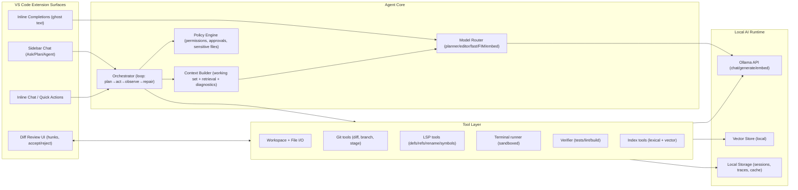
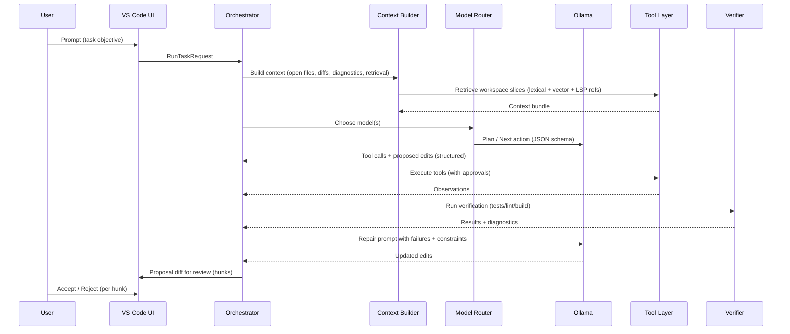

# Pulse parity blueprint for a local VS Code agent using Ollama

## Executive summary

Pulse already has several “agentic fundamentals” that put it on the same conceptual track as Codex/Copilot: Ask/Plan/Agent modes, proposal-based edits with revert flow, session memory, tool enable/disable controls, and role-based model routing via Ollama. citeturn7view0turn12view1turn16view0turn35view0 But parity with Codex/Copilot is less about a single model and more about the full system loop: high-quality workspace context, reliable multi-step tool execution, strong verification gates, and a polished IDE UX (inline/next-edit completions, multi-file edit review, safe-by-default commands). Codex explicitly frames long-horizon success as an iterative loop—plan, edit, run tools, observe, repair, repeat—and emphasizes sandboxing and approvals when acting locally. citeturn37search3turn37search2turn37search12 Copilot emphasizes the same: inline suggestions as you type, edit/agent modes that can propose multi-file changes and iterate on build/test output, plus safety affordances like requiring confirmation for sensitive edits. citeturn38search0turn38search18turn38search16

The biggest gaps to close (in priority order) are:

1) **IDE-native coding UX**: inline completions (ghost text), “next edit” style changes, and a first-class multi-file diff review workflow (hunks, accept/reject, staging). citeturn42view0turn38search0turn38search1  
2) **Code intelligence via indexing + LSP**: semantically retrieving the right code slices (hybrid lexical + embeddings) and accurate symbol operations (references/rename/definition) via VS Code’s language features, instead of heuristics. citeturn36search2turn36search6turn39search1turn39search7  
3) **Verification-first autonomy**: a deterministic “prove it” loop that runs project checks, parses diagnostics, and repairs until green—mirroring Codex/Copilot behavior. citeturn37search3turn38search18turn16view1  
4) **Safety + permissions that feel professional**: tighten terminal sandboxing, implement “sensitive file” guardrails, and add explicit approval levels with clear UI. citeturn37search2turn37search12turn38search16turn35view0  
5) **Performance engineering for local systems**: context budgeting, caching, model keep-alive/unload, and fast retrieval to keep latency acceptable. citeturn41view0turn25view1turn12view1

## The parity bar

### What Codex sets as the “agent” baseline

Codex is positioned as a software engineering agent that can run tasks in parallel, operate in a sandbox, propose PR-ready changes, and iterate by running tests/tools until it passes. citeturn37search1turn37search3turn37search2 Codex also formalizes **durable project instructions** (`AGENTS.md`) and **skills** (packaged workflows/instructions/resources) as first-class features. citeturn37search0turn37search4turn37search9 Locally, Codex emphasizes **sandboxing + approvals** and often defaults network off. citeturn37search2turn37search12

### What Copilot sets as the “IDE experience” baseline

In VS Code, Copilot focuses on:
- **Inline suggestions (ghost text) as you type**, plus “next edit suggestions” in the inline suggest surface. citeturn38search0  
- **Inline chat** for selected code and editor context. citeturn38search1  
- **Agent mode** that can multi-step: analyze codebase, read files, propose edits, run commands/tests, observe failures, and iterate to completion. citeturn38search18turn38search4  
- **Safety controls**, including confirmation for edits to sensitive files in agent mode. citeturn38search16  
GitHub also documents a “Copilot coding agent” that can work from issues and open PRs. citeturn38search3turn38search19

### Pulse today vs parity targets

Pulse already provides a structured agent runtime with a tool execution layer, tool throttling, safe-command checks, and model routing defaults (planner/editor/fast/embedding) and token budgeting behaviors. citeturn7view0turn14view2turn35view0turn12view1 It also already uses JSON Schema-constrained structured output for local models via Ollama `format`, which is a major reliability step for tool orchestration. citeturn16view0turn41view0

The “parity gap” is mainly that Copilot/Codex ship:
- a **dedicated inline completion + next-edit surface** deeply integrated with typing, caret context, and completions UX; citeturn38search0turn42view0  
- **semantic indexing** and tighter language-intelligence hooks (definitions/references/rename via language services); citeturn36search2turn36search6turn39search1  
- a **verification-driven loop** that pushes the agent toward passing tests/build rather than “looks plausible”; citeturn37search3turn38search18  
- **sandbox/approval UX** that feels like a product, not just a setting. citeturn37search2turn38search16

## Architecture and data flows

Pulse already has strong separation points in code (runtime, tool executor, scanner, permissions, sessions, edits). citeturn14view0turn34view0turn20view0 The parity move is to formalize these into clear contracts and add two new pillars: (1) inline completion service (FIM), (2) semantic workspace index + language-server-backed symbol tools.



The core execution loop should be explicitly modeled (state machine) because long-horizon agent success is predominantly a “loop engineering” problem (Codex calls this out directly). citeturn37search3turn39search0



## Prioritized feature checklist with implementation guidance

Pulse currently throttles tool calls per turn (max 5) and uses a simple concurrency gate (“only one task runs at a time”). citeturn34view1turn14view2 That’s sensible for stability on local hardware; parity means keeping that stability while increasing correctness and UX polish.

### Parity checklist (P0 first)

| Priority | Area | What to implement | Implementation guidance (TypeScript + VS Code ecosystem) |
|---|---|---|---|
| P0 | Inline completions | **Ghost-text inline completion provider** | Use `vscode.languages.registerInlineCompletionItemProvider` and return `InlineCompletionItem`s; VS Code requests providers automatically while typing and also explicitly. citeturn42view0turn42view2 Back the provider with a **FIM prompt** (prefix = text before cursor; suffix = text after cursor). Prefer `Ollama POST /api/generate` with `prompt` + `suffix` for FIM-style models. citeturn41view0 Add aggressive cancellation (`CancellationToken`) and strict latency budgets (e.g., 150–400ms). citeturn42view2 |
| P0 | Multi-file edit UX | **Git-backed hunk UI + staged apply** | Maintain an “agent branch” or “agent checkpoint” concept and render changes as hunks with accept/reject. Copilot’s user trust is largely the review flow. citeturn38search16turn37search3 In VS Code, use diff views (`vscode.diff`) for file-level review and decorations for hunk controls. Implement `WorkspaceEdit` application in small chunks and keep snapshots for revert (Pulse already has EditManager + revert flow conceptually). citeturn7view0turn16view3 |
| P0 | Tool reliability | **Schema-first tool calling and tool traces everywhere** | Keep Pulse’s JSON Schema constrained protocol and extend it: every tool call must include `expectedOutcome`, and every observation must include `ok`, `summary`, and `detail`. Pulse already normalizes tool call variants from local models; expand this to a strict “tool call contract” and validate at runtime. citeturn16view1turn16view0 |
| P0 | Verification loop | **“Green-or-explain-why-not” verifier** | Codex and Copilot agent mode explicitly iterate on build/test output. citeturn37search3turn38search18 Implement a deterministic verifier: detect project type (Node/Python/etc.), run the minimal smoke command set, parse output, re-run targeted tests, and feed failures back into the agent loop. Pulse already has `run_verification` and `get_problems`; make them first-class gating steps for edits. citeturn34view0turn16view1 |
| P0 | Safety & approvals | **Approval modes + sensitive file rules + terminal sandbox mode** | Codex emphasizes sandbox boundaries + approval policy; Copilot has explicit settings to confirm edits to sensitive files. citeturn37search2turn37search12turn38search16 In Pulse, tighten: (1) approval levels for terminal/network/file deletes, (2) sensitive path patterns (e.g., `.env`, CI secrets, SSH keys, `~/.ssh/**`), (3) “dry-run first” for destructive git/terminal. Pulse already blocks unsafe commands unless terminal execution is allowed; broaden `isSafeTerminalCommand` into an allowlist-by-tool + per-project policy. citeturn35view0turn16view2 |
| P1 | Workspace indexing | **Hybrid retrieval: lexical + embedding + rerank + diversify** | Implement Retrieval-Augmented Generation patterns: chunk code, embed chunks, retrieve top-k, and include in context. citeturn39search1 Combine lexical BM25 with dense vectors for robustness (BM25 is a standard baseline for term overlap). citeturn39search7turn39search19 Diversify retrieved chunks with Maximal Marginal Relevance (MMR) to reduce redundancy. citeturn39search2 |
| P1 | Language intelligence | **LSP-backed symbol tools (defs/refs/rename/symbols)** | Replace heuristic `find_references` with VS Code “execute*Provider” commands where available (definition/ref provider). citeturn36search2turn36search6 Pattern: `vscode.commands.executeCommand('vscode.executeDefinitionProvider', uri, pos)` etc. citeturn36search2 This becomes the basis for accurate refactors and “safe rename” tools. |
| P1 | “Instructions + skills” | **AGENTS.md + skills folders + project detection** | Codex loads `AGENTS.md` automatically and promotes reusable “skills.” citeturn37search0turn37search4turn37search9 Copilot also supports custom instructions and “agent skills.” citeturn38search23turn38search12 Add: (a) repo-level `AGENTS.md` (and optional subdir overrides), (b) `skills/` directories that register tool recipes and prompt templates. |
| P1 | Multi-agent orchestration (optional) | **Parallel subagents for exploration/refactor/test** | Codex supports subagents for parallel exploration. citeturn37search10turn37search1 On local hardware, implement as “virtual subagents” (separate prompts + budgets) rather than parallel model loads; keep concurrency small. Pulse already has a single-task queue—keep that, but allow internally parallel “read-only gatherers” (search/index/LSP) that don’t require model inference. citeturn14view2turn34view1 |
| P2 | Telemetry (privacy-first) | **Local traces + opt-in export (OpenTelemetry)** | Instrument the agent loop with spans (plan/tool/verify) and persist local traces for debugging regressions. OpenTelemetry provides a standard for instrumentation/export. citeturn5search27 Make export opt-in; default to local-only. |
| P2 | Evaluation harness | **Benchmarks + regression tests + human review loops** | Use SWE-bench style repo-level tasks to evaluate “agent that edits code and runs tests.” citeturn1search0turn2search0 Mirror Codex’s emphasis on high-quality tests as a truth source. citeturn37search13turn37search3 |

### Options comparison tables

#### Semantic indexers for a local VS Code agent

| Option | Strengths | Weaknesses | Best fit for Pulse parity |
|---|---|---|---|
| VS Code API file enumeration + keyword scan (current-ish) | Simple, portable, no native deps; Pulse already does path keyword weighting + small content scans. citeturn20view0 | Slow for large repos; limited relevance; not semantic; “find references” is textual. citeturn34view2turn20view0 | Keep as fallback and “fast path” when index not ready. |
| LSP/VS Code execute providers (defs/refs/symbols) | Accurate symbol graph where language server exists; integrates with IDE truth. citeturn36search2turn36search6 | Coverage varies by language; performance can be uneven at workspace scale. citeturn36search7 | Use for refactors and precise “what calls this?” queries. |
| Hybrid RAG index (BM25 + vectors + MMR) | Robust retrieval across naming styles; supports semantic “where is auth handled?” queries. citeturn39search1turn39search7turn39search2 | Requires chunking, embeddings, storage, refresh logic | This is the parity backbone for codebase understanding + planning. |

#### Embeddings & local vector storage

| Component | Options (local-first) | Notes |
|---|---|---|
| Embedding model via Ollama | `nomic-embed-text` is an embedding-only model in Ollama. citeturn29search1turn29search16 | Good baseline; long-context embedding report exists; requires Ollama version support. citeturn29search1turn29search16 |
| Vector store | SQLite vector extensions (e.g., SQLite-Vector) citeturn5search32turn5search34 | Embedded DB aligns well with VS Code extension packaging; good for moderate-scale indexes. |
| Vector store | LanceDB citeturn5search24turn5search28 | More “vector-native”; good if you expect large workspaces and frequent similarity queries. |

#### Local model runtimes (for Pulse’s constraints)

| Runtime | Why it matters | Parity implication |
|---|---|---|
| Ollama | Provides `/api/chat`, `/api/generate`, embeddings endpoints, JSON output mode (`format`), FIM-style `suffix`, and `keep_alive`. citeturn41view0turn25view1 | Pulse can implement Copilot-like inline completions (FIM), robust tool-calling (JSON), and performance control (keep_alive/unload). citeturn41view0turn25view1turn16view0 |

## Ollama integration patterns for “Copilot-like” behavior

Pulse already calls `/api/chat`, supports streaming, uses `keep_alive` to unload models, and tracks token counts from Ollama responses. citeturn25view0turn25view1turn12view1 To reach parity, you want **four distinct inference modes**, each tuned differently.

### Model routing and inference modes

1) **Planner (slow reasoning, tool-first)**  
   Use `POST /api/chat` with `format: {schema}` or `format: "json"` when possible so the model emits tool calls reliably. citeturn41view0turn16view0 This is the “agent loop brain,” aligned with Codex’s long-horizon plan/edit/test iteration. citeturn37search3

2) **Editor (diff-aware, refactor-safe)**  
   Keep structured output: edits should be represented as operations (write/patch/rename/delete) rather than raw prose. Pulse already has a `TaskToolName` set including `batch_edit`, `rename_file`, and `git_diff`. citeturn16view3turn34view0 Extend the edit format to include range-based patches (line/char spans) to enable hunk review.

3) **Inline completion (FIM, ultra-low latency)**  
   Use `POST /api/generate` with `prompt` (prefix) + `suffix` (after-cursor text). citeturn41view0 Keep token output tiny, temperature low, and add hard timeouts. Tie directly to VS Code inline completion provider APIs. citeturn42view0turn42view2

4) **Embeddings (indexing + memory)**  
   Use Ollama’s embeddings endpoints (“Generate Embeddings”) per its API docs. citeturn41view0 If you use `nomic-embed-text`, treat it strictly as embedding-only (it cannot chat). citeturn29search1

### Context management, budgets, and caching

Pulse already resets its “token usage state” when it approaches a configured token budget (example: reset at 90% usage). citeturn12view1 Parity improvements:

- **Context builder should be deterministic**: always build a “working set” package: active file + selection + diagnostics + relevant diffs + retrieved code slices. Codex’s loop depends on consistently observing tool output and iterating. citeturn37search3  
- **Cache three things** for local speed: (a) embeddings, (b) chunked file text + AST metadata, (c) tool observations (like `git_diff`, `get_problems`) keyed by commit hash + file mtimes.  
- **Use `keep_alive` to manage VRAM**: Ollama exposes `keep_alive` on generate/chat; set short keep-alive for large models, and explicitly unload by setting `keep_alive: 0` when switching models. citeturn41view0turn25view1turn25view0 Pulse already has an unload method based on this concept. citeturn25view0  
- **Fallback strategies**: if planner model fails schema validation, fall back to a more instruction-following model; Pulse already supports configured fallback models. citeturn7view0turn16view0

## Verification, safety, and evaluation

### Safety model: permissions, approvals, sandboxing

Codex frames sandboxing as a boundary that lets the agent act without unrestricted machine access, paired with approval policies. citeturn37search2turn37search12 Copilot similarly warns about sensitive file edits and offers settings that require confirmation. citeturn38search16

Pulse already blocks “unsafe” terminal commands unless terminal execution is enabled, and emits a clear observation. citeturn35view0turn16view2 To reach parity-level trust, implement:

- **Approval modes** (Strict / Balanced / Fast) that map to concrete policy gates: file deletion/rename, edits to sensitive paths, terminal commands with network or install operations, git operations that rewrite history. Pulse already exposes an `approvalMode` concept in runtime state. citeturn14view1  
- **Sandboxed terminal executor**: “best effort” cross-platform approach is (a) default to no network, (b) run commands in a container (Docker/Podman) when available, (c) otherwise enforce allowlists and require explicit approvals. This mirrors Codex’s “constrained environment instead of full access by default.” citeturn37search2turn37search12  
- **Evidence-based completion**: never “declare done” without verifier output for code-changing tasks; Codex explicitly iterates until tests pass. citeturn37search3turn37search1 Pulse’s quality scoring already rewards tool observations and verification; make this a hard gate in Agent mode. citeturn16view1

### Evaluation plan: what to measure and how

A parity evaluation should separate (1) **coding UX quality**, (2) **agent correctness**, (3) **safety correctness**, (4) **performance**.

- **Benchmarks (automated)**  
  Use SWE-bench-style tasks for repo-level bugfix/refactor evaluation because they measure “edit code + run tests + make it pass.” citeturn1search0turn2search0  
  Add a private suite of “Pulse parity tasks” that force multi-file edits, dependency changes, and verification loops (because that’s what Copilot agent mode claims). citeturn38search18turn37search3  

- **Metrics (track per task prompt)**  
  Success rate (tests pass), number of agent loops, tool-call validity rate (schema compliance), number of unsafe attempts blocked, mean time-to-first-suggestion for inline completions, median end-to-end time, and “human accept rate” for hunks.

- **Human-in-the-loop protocol**  
  Run a consistent review checklist: correctness, minimal diff, style adherence, explanation quality, and whether it asked for approval at the right times (mirroring Codex/Copilot trust design). citeturn37search9turn38search16  

## Roadmap, repo structure, and stress-test super prompts

### Suggested folder structure and API contracts

Pulse already follows a strong `src/agent/**` structure (runtime, indexing, memory, model, permissions, skills). citeturn9view0turn32view0 The parity refactor is mostly additive:

```text
src/
  extension/                  # VS Code registrations (commands, providers, webviews)
    activate.ts
    inlineCompletion.ts        # InlineCompletionItemProvider → FIM calls
    inlineChat.ts              # Optional: editor inline chat hooks
    diffReview.ts              # Hunk UI + apply/reject
  agent/
    orchestration/
      orchestrator.ts          # agent loop state machine
      contextBuilder.ts        # working set assembly + budgets
      modelRouter.ts           # planner/editor/fast/FIM/embed selection
      policyEngine.ts          # approvals, sensitive file rules
    tools/
      lspTools.ts              # executeDefinition/Reference/Rename providers
      gitTools.ts              # diff/stage/branch/checkpoint
      terminalTools.ts         # sandbox runner + allowlists
      verifier.ts              # project detector + test runners
      indexTools.ts            # search + retrieval APIs
    indexing/
      lexical.ts               # existing scanner fallback
      chunker.ts               # AST-aware chunking
      embeddings.ts            # Ollama embeddings client
      vectorStore.ts           # sqlite/lancedb adapter
    protocols/
      taskSchema.ts            # JSON schema + validation
      toolContracts.ts         # tool request/response types
```

**Key contracts (stability over cleverness)**:
- `ContextBundle`: open documents, selection, diagnostics, git status/diff, retrieved chunks, instructions (`AGENTS.md`), tool trace summary.
- `ToolCall` / `ToolObservation` typed exactly like your JSON Schema expects (Pulse already does this normalization; keep extending it). citeturn16view1turn34view1  
- `Proposal`: list of file hunks + metadata + verification evidence, not just raw “edits”.

### Phased roadmap with effort estimates

Effort estimates below assume one developer who already understands the codebase and VS Code extension development; “hours” are rough and depend strongly on scope.

| Phase | Goal | Deliverables | Effort |
|---|---|---|---|
| Foundation | “Agent loop is strict and observable” | Orchestrator state machine, tool trace persistence, verifier gating in Agent mode, improved policy engine (approval modes + sensitive files) aligned with Codex/Copilot safety posture. citeturn37search3turn38search16turn14view1 | ~40–80h |
| IDE parity core | “Feels like Copilot in the editor” | InlineCompletionItemProvider wired to Ollama `/api/generate` with `suffix`; cancellation + latency budgets; multi-file diff review panel with hunk accept/reject. citeturn42view0turn41view0turn38search0 | ~60–120h |
| Intelligence upgrade | “Find the right code, refactor safely” | Hybrid index (BM25 + vectors + MMR), background indexing, LSP-backed refs/rename/definition tools. citeturn39search1turn39search7turn39search2turn36search2turn36search6 | ~80–160h |
| Robust autonomy | “Iterate until green” | Project detector, test/lint/build recipes, diagnostics parsing, automatic repair loop with bounded retries; “best-of-n” optional for repair candidates (Codex highlights this workflow pattern). citeturn37search25turn37search3 | ~60–140h |
| Evaluation + hardening | “Regression-proof” | SWE-bench-like harness, curated local task suite, performance profiling, opt-in OpenTelemetry traces. citeturn1search0turn5search27 | ~40–120h |

### Two “super prompts” for stress-testing Pulse

These prompts are designed to test: multi-step planning, tool use, safe approvals, multi-file edits, verification loops, context window discipline, and restraint (no hallucinated file paths).

#### Super prompt for an empty project build

Use this in an empty directory. It is intentionally strict and “Copilot/Codex-like.”

```text
You are a local VS Code coding agent. Your job is to create a complete project from scratch in this EMPTY folder.

Hard constraints:
- You MUST plan first, then implement. Use a short plan.
- You MUST NOT assume any files exist. Use workspace_scan and list_dir first.
- You MUST create a minimal but real app + tests + linting + formatting + CI config.
- You MUST provide a reviewable diff proposal (do not auto-apply unless I approve).
- You MUST run verification commands and paste the outputs you observed.
- If a terminal command is unsafe or requires network access, ask for approval first.
- Keep changes tight: no unnecessary libraries.

Project to build:
- TypeScript Node.js CLI tool named "pulse-parity-lab".
- Commands:
  1) `pp scan <path>` scans a directory and prints: file count, total bytes, top-10 largest files.
  2) `pp grep <pattern> <path>` searches text files and prints matches with file:line.
- Include:
  - Unit tests (fast, deterministic) for core logic.
  - A README with usage examples.
  - Lint + format config.
  - GitHub Actions workflow that runs tests and lint on push.

Workflow:
1) Inventory workspace
2) Draft plan + file list
3) Implement incrementally (small commits/patches)
4) Run tests + lint + typecheck, then fix until green
5) Present final summary + how to run

Begin now.
```

What this tests against parity claims:
- “Plan → edit → run tools → observe → repair → repeat” loop (Codex) citeturn37search3  
- Multi-file creation + verification loop (Copilot agent mode) citeturn38search18  
- Safe tool gating + approval behavior (Codex approvals; Copilot sensitive edits) citeturn37search12turn38search16  

#### Super prompt for repo-scale refactor

Use this inside a real repo (or in Pulse’s own repo). It tests LSP refs/rename, indexing, and hunk-based review.

```text
You are a local VS Code coding agent working in an EXISTING repository.

Objective:
Refactor the codebase to introduce a clean "core/infra/ui" layering WITHOUT breaking behavior.

Non-negotiable rules:
- Start by identifying the project type and how to run tests/build.
- Use git_diff + get_problems + run_verification as evidence gates.
- Do NOT rename or move files until you show a proposed plan and I approve.
- Any rename must be done with a references-aware approach (no naive search/replace).
- Keep edits reviewable: group changes into small hunks and explain each group.
- If you cannot verify (missing deps), explain what you tried and what blocked you.

Refactor requirements:
- Create:
  - src/core/ (pure logic, no VS Code APIs)
  - src/infra/ (filesystem, git, terminal, LLM providers)
  - src/ui/ (webview, VS Code commands/providers)
- Move code accordingly, update imports, and keep public APIs stable.
- Add at least 5 targeted unit tests for core logic.
- Ensure `npm test` (or equivalent) passes.

Process:
1) Workspace inventory + identify entrypoints
2) Minimal design doc: module boundaries + API contracts
3) Implement in phases, verifying after each phase
4) Provide final diff proposal + verification outputs
5) Summarize risks and follow-ups

Begin.
```

Why this is a strong stress test:
- Forces the “agent loop” and verification discipline. citeturn37search3turn38search18  
- Forces symbol-aware refactors (via language tooling) rather than regex. citeturn36search2turn36search6  
- Forces a Copilot-like multi-file edit review posture (confirming sensitive edits aligns with product safety expectations). citeturn38search16  

