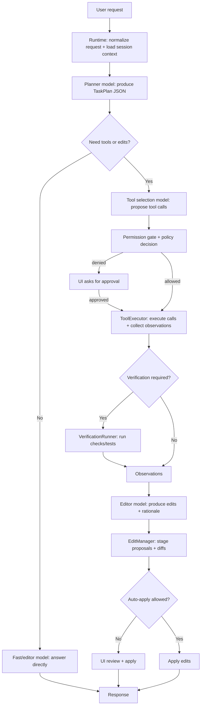
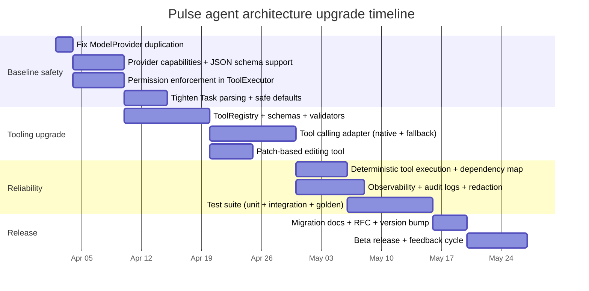
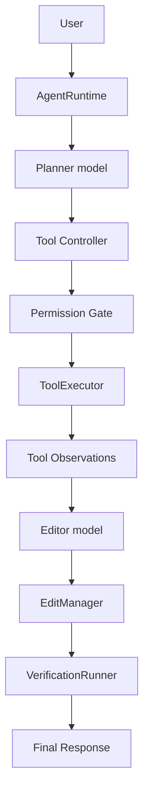
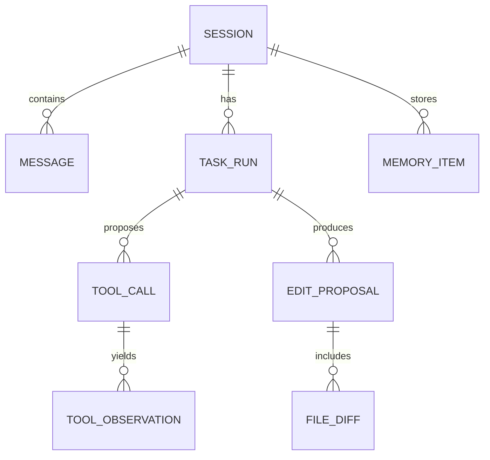
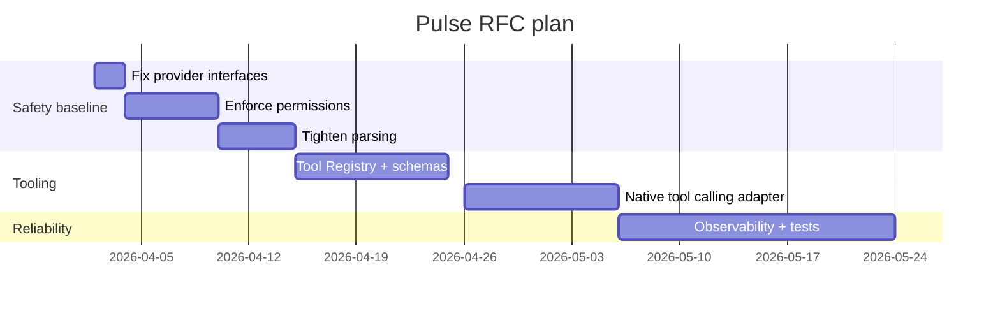

# Deep research on OpenCode and Pulse with a proposed next-generation Pulse agent architecture

## Executive summary

This report analyzes the OpenCode repository (anomalyco/opencode) and the Pulse repository (OchiengPaul442/pulse) as of April 1, 2026 (Africa/Kampala), focusing on (a) how OpenCode structures model/provider abstraction, tool-calling, and agent/session orchestration, and (b) how Pulse currently implements an agent inside a VS Code extension—then proposes a comprehensive, implementable toolset and improved architecture for Pulse.

OpenCode’s codebase shows a strongly layered design: a provider layer that represents providers and models as typed schemas with effectful interfaces, a tool layer that couples strict input validation (Zod) with tool-specific prompt templates, and a session/message model that treats tool calls/results as first-class message parts (with additional hygiene like scrubbing tool call IDs). citeturn38view3turn38view12turn38view5turn38view14turn15view1turn19view1 OpenCode also demonstrates pragmatic cross-provider capability handling (notably for Anthropic tool streaming features via custom headers) and per-model sampling parameter tuning based on model family heuristics. citeturn38view4turn38view6

Pulse already has several “right building blocks” for a robust agent: a multi-model role concept (planner/editor/fast/embedding), a structured Task protocol with tool calls and observations, a dedicated ToolExecutor layer, session/memory/edit/verification subsystems, and a permission policy model. citeturn31view0turn25view0turn27view3turn30view2turn33view1 However, key parts are not yet wired together or are inconsistent: tool calling is implemented primarily via JSON parsing heuristics rather than native function/tool calling; permissive parsing and aliasing increases the chance of accidental tool execution; permission infrastructure is defined but not clearly enforced in the orchestration path; and the model/provider abstraction has a concrete code smell (duplicate `ModelProvider` interface declarations). citeturn23view1turn24view3turn30view2turn22view0 Some provider choices are also behind current platform direction: OpenAI’s modern guidance moves structured outputs from Chat Completions’ `response_format` toward the newer Responses API `text.format`. citeturn40search0turn40search17

The proposed Pulse architecture in this report keeps VS Code-first UX, but upgrades the agent core to a capability-aware orchestrator that supports both (1) native tool/function calling when a provider supports it and (2) a compatible structured JSON protocol fallback for local models. It also introduces: a first-class Tool Registry with JSON Schema contracts, explicit permission gates integrated into ToolExecutor, deterministic caching and state management, comprehensive observability, and a testable separation between “core agent” and “IDE adapter”. The toolset design covers filesystem, code intelligence (LSP), git, terminal, verification, web research, MCP integration, memory/RAG, and project workflows, with clear I/O contracts, auth handling, and failure modes.

Compute/budget/latency constraints were unspecified; the design therefore targets “no specific constraint” and provides scalable choices (local-only, hosted-only, hybrid). citeturn10view1turn39view7turn41search9

## OpenCode repository findings

OpenCode’s implementation is instructive because it operationalizes three hard problems—provider heterogeneity, tool-calling as a first-class workflow, and session complexity—without collapsing everything into a single “giant agent file”.

### Provider and model handling

OpenCode models providers and their available models as a typed schema and exposes a provider “service interface” with effectful operations (list providers, get provider, get model). citeturn38view3 This pattern is useful for Pulse because it separates “what models exist and what they can do” from “how the agent chooses and uses them”.

OpenCode includes explicit provider-specific capability configuration at load time. A concrete example is a custom loader for Anthropic that sets an `anthropic-beta` header enabling features including “fine-grained tool streaming” and “interleaved thinking” (as labeled in the header value). citeturn38view4 The key idea is not the particular header string, but the pattern: “capabilities are provider-scoped and negotiated/activated in the provider adapter, not sprinkled throughout agent logic”.

OpenCode also includes per-model sampling parameter heuristics keyed off model IDs/families—e.g., `topP()` returning different values when IDs include certain substrings (“qwen”, “gemini”, “kimi”, “minimax-m2”), implying model-family-aware defaults rather than one-size-fits-all inference settings. citeturn38view6 Pulse can benefit from this approach because it currently mixes disparate backends (Ollama + OpenAI-compatible) but does not clearly express per-model behavioral tuning.

### Tool-calling and tool interfaces

OpenCode’s internal message model treats tool calls and tool results as first-class message “parts”, using part types like `tool-call` and `tool-result`. citeturn38view14turn38view5 In addition, OpenCode applies hygiene transformations over messages—e.g., scrubbing `toolCallId` fields in tool-call/tool-result parts for both assistant and tool-role messages. citeturn38view5 This is a direct, code-level signal of two mature concerns:

- Tool calls are not merely text patterns; they are structured objects in the conversation trace. citeturn38view14turn38view5  
- Operational metadata (IDs) may be treated as sensitive or at least “log-safe”, and therefore scrubbed before persistence or as part of transforms. citeturn38view5

OpenCode also shows a robust “tool contract enforcement” pattern: before executing a tool, it validates args using a Zod schema and throws a tool-specific validation error instructing the caller to rewrite inputs to match the expected schema. citeturn38view12 This is a key pattern Pulse should adopt more systematically: failing closed on schema mismatches reduces unintended side effects, and the rewrite-on-failure message provides a highly actionable recovery path for the model. citeturn38view12

OpenCode’s tool system is also clearly prompt-driven: the tool directory includes paired `*.ts` and `*.txt` files (e.g., `bash.ts`/`bash.txt`, `websearch.ts`/`websearch.txt`, `write.ts`/`write.txt`, `plan.ts` plus plan enter/exit templates). citeturn15view1turn17view0 This suggests a “prompt-per-tool” design where each tool has a dedicated instruction template, rather than one monolithic system prompt, improving maintainability and allowing tool-specific safety constraints and examples. citeturn15view1turn17view0

Finally, OpenCode’s tool layer is permission-aware at the type/interface boundary: the tool module imports and references a `Permission` type in the tool context model. citeturn38view13 Together with a dedicated `permission/` module containing an evaluator and schema, OpenCode indicates an explicit place where permission checks belong: between “tool requested” and “tool executed”. citeturn15view2turn38view13

### Agent and orchestration patterns

OpenCode’s agent module imports `generateObject` and `streamObject` (and `ModelMessage`) from a package named `ai`, while also importing provider/model IDs, a provider transform module, auth utilities, and a truncation tool, and referencing a top-level prompt template (`generate.txt`). citeturn38view8 The key architectural pattern is that orchestration is constructed out of explicit primitives:

- **Provider + model identity**: explicit selection via `ProviderID` and `ModelID`. citeturn38view8  
- **Prompt templates**: externalized to files (e.g., `generate.txt`) and imported. citeturn38view8  
- **Transform pipeline**: a provider transform module is explicitly used, rather than ad-hoc formatting. citeturn38view8turn38view5  
- **Operational tools used by the agent runtime**: e.g., truncation is a tool-like capability invoked by orchestration. citeturn38view8  

OpenCode also has dedicated `session/` infrastructure indicating mature management of practical agent concerns: compaction, message schemas, overflow handling, processing/projecting, retry logic, and summary generation. citeturn19view1 This is one of the strongest “learn-from” signals for Pulse: production agents are mostly about managing state and failure recovery—not only “prompting well”.

### Error handling and security considerations

OpenCode demonstrates several concrete safety/error patterns in code and structure:

- **Schema-validated tool execution** with errors designed for model recovery (“rewrite input so it satisfies expected schema”). citeturn38view12  
- **Permission infrastructure** as a dedicated module and as a tool-context concept. citeturn15view2turn38view13  
- **Tool-call metadata scrubbing**, a practical “don’t leak operational IDs / don’t couple logs to internal correlation IDs” approach. citeturn38view5  
- **Provider auth indirection** via environment variables and an Auth store (as implied by `Auth.get` usage in provider configuration). citeturn38view4turn38view8  
- **Risky capability isolation**: the presence of tools like `bash` and `webfetch` in the tool registry suggests risk is managed via tooling + permission, not by pretending the agent won’t need power tools. citeturn17view0  

## Pulse repository assessment

Pulse is a VS Code extension agent with a recognizable agent stack, but the code indicates it is currently operating at an intermediate maturity level: strong scaffolding, but incomplete wiring and some risky default behaviors.

### Current architecture and execution model

Pulse registers a runtime (`AgentRuntime`) from `activate()` and makes UI available even if provider initialization fails (degraded mode). citeturn10view1turn10view2 It selects between an Ollama backend and an OpenAI-compatible backend; notably, “openai”, “anthropic”, and “custom” provider types all use the same OpenAI-compatible client class. citeturn10view0turn22view0

Pulse already encodes a multi-role model concept: the runtime tracks planner/editor/fast/embedding in its type system. citeturn31view0 The planner module uses JSON-mode planning by calling `provider.chat({ format: "json" })` with a system prompt that demands strict JSON and then parses with `JSON.parse`. citeturn39view7 This is a pragmatic approach for local models too because Ollama also supports a `format` field and structured outputs. citeturn26view3turn41search9turn41search0

Tool calling is designed around a structured task payload. `TaskProtocols.ts` defines a schema-like shape with (at least) `response`, `todos`, `toolCalls`, `edits`, and `shortcuts`, and it enumerates a broad set of tool names (filesystem, terminal, git, diagnostics, LSP, MCP, etc.). citeturn25view0turn24view5 Pulse also implements significant robustness hacks for local model JSON: extracting JSON from arbitrary text, repairing broken JSON (trailing commas, unquoted keys, single quoted values), and even wrapping top-level fragments. citeturn23view1turn24view2turn24view3

The ToolExecutor runs tool calls in batches (up to 5 per turn) using `Promise.allSettled`, executes or reports failures per tool, and reports “dropped tool calls” beyond 5 (the model is asked to re-issue them next iteration). citeturn27view3turn37view2 Terminal execution is gated by a combination of `isSafeTerminalCommand(command)` and `allowTerminalExecution`; unsafe commands are denied when terminal execution is disabled. citeturn37view0

A modular tool interface (`AgentTool`) exists and tools such as `WriteFileTool` or git/LSP tools provide `name`, `description`, and `parameterHints` in a “Copilot-style” UX. citeturn39view8turn39view9turn39view10turn39view11

### Concrete gaps and code smells

The issues below are “code-backed”; where the repo evidence is partial, the finding is stated conservatively.

**Duplicate interface definition in ModelProvider**
`ModelProvider.ts` defines `export interface ModelProvider` twice—one version includes `providerType`, the second omits it—creating ambiguity for TypeScript tooling and maintainers. citeturn22view0 This is a correctness and maintainability smell, and it can silently degrade type checking depending on compilation details. citeturn22view0

**Tool calling relies on permissive parsing and aliasing**
Pulse’s `parseTaskResponse` includes aggressive JSON “repair” and multiple fallback patterns. citeturn23view1turn24view3 It also accepts tool call aliases (`toolCalls`, `tool_calls`, `action`, `actions`), top-level single tool calls, and a large alias map that normalizes hallucinated tool names into real tools. citeturn24view0turn24view5turn25view0 While this helps local models, it also raises the probability of accidental or adversarial tool execution if the model emits braces or “action-like” fragments in normal text. citeturn24view2turn24view3turn25view0

**Permission system exists but is not clearly enforced**
Pulse includes a fairly complete `PermissionPolicy` with modes (`full`, `default`, `strict`), action categorization, and an evaluation model that can require approval for sensitive operations in default mode. citeturn30view0turn29view1turn30view2 The runtime constructs a `PermissionPolicy`, but in the code slices examined, there is no evidence of orchestration calling `permissionPolicy.evaluate(...)` during tool execution, and ToolExecutor also does not reference PermissionPolicy. citeturn34view0turn27view0 (This does not prove it is unused, but it is a red-flag requiring confirmation and likely integration.)

**Provider modernization debt**
Pulse’s OpenAI-compatible provider uses the Chat Completions endpoint and JSON mode (`response_format: { type: "json_object" }`). citeturn26view0turn26view1 OpenAI’s current docs emphasize migration toward the Responses API and move structured outputs from `response_format` to `text.format` in that API. citeturn40search0turn40search17 Even if Pulse stays “OpenAI-compatible” (i.e., supports multiple providers advertising the OpenAI schema), the architecture should be capability-aware to support modern structured outputs and tool calling where available.

**Potential concurrency and state hazards**
ToolExecutor executes up to five tools concurrently (`Promise.allSettled`), which can be problematic when tool calls are not independent (e.g., editing files and then reading them, running terminal commands and then asking for output). citeturn27view3turn37view0 Without explicit dependency modeling or per-tool concurrency controls, this increases flakiness.

**Security boundary inconsistencies**
PermissionPolicy “default” mode lists `terminal_exec` as a safe action (auto-approved) while separate runtime config includes `allowTerminalExecution` gating unsafe commands. citeturn30view2turn37view0turn33view1 This split can lead to confusing behavior and should be unified into one consistent permission story.

### Prioritized improvements with effort and risk

Effort is estimated as engineering time for a single experienced maintainer, excluding UI polish and multi-platform QA.

| Priority | Improvement | Why it matters | Effort | Risk |
|---|---|---|---|---|
| High | Wire PermissionPolicy into ToolExecutor + runtime orchestration | Prevents accidental destructive/network/package actions; resolves “defined but not enforced” risk. citeturn30view2turn37view0 | 3–6 days | High (security + user trust) |
| High | Replace permissive JSON parsing with capability-aware structured output enforcement | Reduces tool injection risk and parsing bugs; uses provider features where possible. citeturn23view1turn40search0turn41search0 | 5–10 days | High (agent reliability) |
| High | Fix `ModelProvider` duplication and introduce provider capabilities | Removes type ambiguity; enables tool calling & structured outputs support. citeturn22view0turn26view0turn41search9 | 0.5–2 days | Medium |
| Medium | Introduce a Tool Registry with JSON Schema and Zod validation (OpenCode-like) | Enforces tool contracts; makes prompts/tool docs maintainable; simplifies testing. citeturn38view12turn15view1turn39view8 | 6–12 days | Medium |
| Medium | Make tool execution deterministic: sequential by default + dependency controls | Reduces flakiness caused by concurrent tool calls. citeturn27view3turn37view0 | 2–5 days | Medium |
| Medium | Observability: structured traces with redaction and audit logs | Debuggability + security posture; aligns with “toolCallId scrubbing” pattern seen in OpenCode. citeturn38view5turn10view1 | 4–8 days | Medium |
| Medium | Add provider modernization layer (OpenAI Responses API optional, tool calling when supported) | Future-proofs; improves structured outputs reliability; supports multiple backends. citeturn40search0turn40search17 | 8–15 days | Medium |
| Low | Improve tool prompts and user-facing “parameterHints” into real JSON schema hints | Better model compliance and reduced alias hacks. citeturn39view8turn25view0 | 2–4 days | Low |

## Proposed toolset and improved architecture for Pulse

This design goalfully borrows from OpenCode’s strongest patterns (typed tools, prompt-per-tool, session pipeline, transforms) while keeping Pulse’s VS Code extension constraints.

### Architectural principles

Pulse should evolve around five principles:

**Capability-aware orchestration**
The orchestrator should detect provider capabilities (supports tool calling, supports structured outputs via schema, supports vision) and use the strongest available mechanism, falling back to the current JSON protocol only when necessary. This aligns with (a) OpenAI’s structured outputs evolution toward Responses API `text.format` and `json_schema`, and (b) Ollama’s native support for JSON schema structured outputs. citeturn40search0turn40search17turn41search0turn41search9

**Typed tool contracts**
Adopt OpenCode’s approach: tools validate their inputs against a schema and return structured results with high-quality error messages when validation fails. citeturn38view12turn39view8

**Tool prompts as first-class assets**
Store per-tool instruction templates (examples, safety constraints, schema snippet) as separate maintainable assets (mirroring OpenCode’s `*.txt` approach). citeturn15view1turn17view0

**Integrated permissions**
All tool calls must pass through a consistent permission gate. VS Code already provides encrypted SecretStorage for sensitive values, and Pulse already uses `context.secrets` for at least one service—extend this pattern to all credentials and to permission audit logs. citeturn10view0turn41search4turn30view2

**Testability by isolation**
Keep core agent runtime independent of VS Code APIs via an adapter boundary (Pulse already moves in this direction with ToolExecutorContext). citeturn37view0turn33view1

### Proposed Pulse agent flow

Below is the recommended runtime flow. It minimizes “model does everything” behavior and uses a predictable loop with tool traces, plans, and verification gates.



This explicit separation reduces the chance that a single malformed JSON response triggers unintended tools, because “tool selection” is a deliberate step and is always permission-gated.

### Toolset specification

Pulse’s toolset should be reorganized into a single registry with stable names, schemas, categories, and permissions. Many of these already exist in some form (filesystem, git, LSP, terminal); the proposal consolidates and makes them explicit. citeturn25view0turn37view2turn39view9turn39view10turn39view11

#### Tool contract standard

Every tool implements a contract:

- **Name**: stable string ID used in tool calls.
- **Purpose**: one sentence.
- **Inputs**: JSON Schema (strict).
- **Outputs**: JSON object with `ok`, `summary`, optional `detail`, plus tool-specific payload.
- **Auth**: where credentials come from (SecretStorage, environment, none).
- **Permission category**: mapped to `PermissionPolicy` action categories (file_read, file_write, terminal_exec, network_request, etc.). citeturn30view0turn30view2
- **Failure modes**: explicit typed errors (validation, not-found, timeout, permission-denied, external-service-failed).
- **Idempotency**: whether the operation is safe to retry automatically.

#### Core tools

The following toolset is designed to be implementable in the current Pulse code structure, while upgrading the contracts. (Inputs/outputs below are “API-level”; internal implementation may vary.)

**Workspace inventory**
- **Tool**: `workspace_scan`
- **Purpose**: List project structure and key files.
- **Inputs**: `{ "maxFiles": number, "includeGlobs"?: string[], "excludeGlobs"?: string[] }`
- **Outputs**: `{ ok, summary, files: string[], truncated: boolean }`
- **Auth**: none
- **Permissions**: file_read
- **Failure modes**: workspaceRoot missing; glob errors
- **Notes**: Pulse already has this behavior and returns a bounded list; keep but schema it. citeturn27view3turn33view1

**Read file snippets**
- **Tool**: `read_files`
- **Purpose**: Read bounded sections of files for context.
- **Inputs**: `{ "paths": string[], "maxChars"?: number, "maxFiles"?: number }`
- **Outputs**: `{ ok, summary, snippets: [{ path, content, truncated }] }`
- **Auth**: none
- **Permissions**: file_read
- **Failure modes**: path traversal attempt; file missing; encoding errors; max limit reached
- **Notes**: Keep snippet limits to avoid token blowups (Pulse already limits reads). citeturn27view3turn27view3

**Write full file**
- **Tool**: `write_file`
- **Purpose**: Overwrite a file with content (Copilot-style).
- **Inputs**: `{ "filePath": string, "content": string }`
- **Outputs**: `{ ok, summary, bytesWritten, diffPreview?: string }`
- **Auth**: none
- **Permissions**: file_write
- **Failure modes**: path traversal; file locked; content too large
- **Notes**: Pulse already has `WriteFileTool` with this intent; upgrade schema + diff preview. citeturn39view9

**Patch apply**
- **Tool**: `apply_patch`
- **Purpose**: Apply unified diff patches to one or more files.
- **Inputs**: `{ "patch": string, "strip"?: number }`
- **Outputs**: `{ ok, summary, appliedFiles: string[], rejectedHunks?: number }`
- **Auth**: none
- **Permissions**: multi_file_edit
- **Failure modes**: patch parse failure; conflicting hunks
- **Notes**: This is one of OpenCode’s explicit tools; Pulse should add it to reduce brittle “rewrite entire file” edits. citeturn15view1turn17view0

**Search in workspace**
- **Tool**: `grep_search`
- **Purpose**: Fast textual search.
- **Inputs**: `{ "query": string, "pathGlobs"?: string[], "maxMatches"?: number }`
- **Outputs**: `{ ok, summary, matches: [{ path, line, preview }] }`
- **Auth**: none
- **Permissions**: file_read
- **Notes**: Pulse already has a related tool class name; formalize it. citeturn37view0turn25view0

**LSP definitions**
- **Tool**: `get_definitions`
- **Purpose**: Jump-to-definition results from the language server.
- **Inputs**: `{ "filePath": string, "line": number, "character": number }`
- **Outputs**: `{ ok, summary, locations: string[] }`
- **Auth**: none
- **Permissions**: file_read
- **Notes**: Pulse already returns normalized file:line references for definitions. citeturn39view11

**LSP references**
- **Tool**: `get_references`
- **Purpose**: Find symbol usages.
- **Inputs**: `{ "filePath": string, "line": number, "character": number, "includeDeclaration"?: boolean }`
- **Outputs**: `{ ok, summary, locations: string[] }`
- **Auth**: none
- **Permissions**: file_read

**LSP diagnostics**
- **Tool**: `get_problems`
- **Purpose**: Return current diagnostics (errors/warnings) from VS Code.
- **Inputs**: `{ "pathGlobs"?: string[] }`
- **Outputs**: `{ ok, summary, problems: [{ path, severity, message, range }] }`
- **Auth**: none
- **Permissions**: file_read
- **Notes**: Pulse tool set includes `get_problems`. citeturn25view0turn37view2

**Rename symbol**
- **Tool**: `rename_symbol`
- **Purpose**: Execute LSP rename refactor safely.
- **Inputs**: `{ "filePath": string, "line": number, "character": number, "newName": string }`
- **Outputs**: `{ ok, summary, affectedFiles: number }`
- **Auth**: none
- **Permissions**: multi_file_edit

**Git status**
- **Tool**: `git_status`
- **Purpose**: Summarize working tree status.
- **Inputs**: `{}`
- **Outputs**: `{ ok, summary, staged: string[], unstaged: string[], untracked: string[] }`
- **Auth**: none
- **Permissions**: git_read
- **Notes**: Pulse includes git tools and checks for repository state. citeturn39view10

**Git diff**
- **Tool**: `git_diff`
- **Purpose**: Provide a diff for current changes.
- **Inputs**: `{ "path"?: string, "cached"?: boolean }`
- **Outputs**: `{ ok, summary, diff: string }`
- **Auth**: none
- **Permissions**: git_read

**Git commit**
- **Tool**: `git_commit`
- **Purpose**: Create a commit with a message.
- **Inputs**: `{ "message": string, "allowEmpty"?: boolean }`
- **Outputs**: `{ ok, summary, commitHash?: string }`
- **Auth**: none
- **Permissions**: git_write (approval required by default mode). citeturn30view2turn30view1

**Run terminal command**
- **Tool**: `run_terminal`
- **Purpose**: Run a shell command in workspace context.
- **Inputs**: `{ "command": string, "timeoutMs"?: number }`
- **Outputs**: `{ ok, summary, exitCode, outputHead, outputTail }`
- **Auth**: none
- **Permissions**: terminal_exec (policy + “unsafe command” gate). citeturn37view0turn30view2
- **Failure modes**: interactive prompt; timeout; tool disabled; permission denied; unsafe gate denies.
- **Notes**: Pulse already implements unsafe gating and emits terminal progress events. citeturn37view0turn33view3

**Run verification workflow**
- **Tool**: `run_verification`
- **Purpose**: Execute “test/build/lint” commands relevant to project type.
- **Inputs**: `{ "kind": "tests"|"build"|"lint"|"typecheck", "commands"?: string[] }`
- **Outputs**: `{ ok, summary, results: [{command, exitCode, outputHead}] }`
- **Auth**: none
- **Permissions**: terminal_exec (approval depending on policy); package_install if installs are attempted. citeturn30view2turn30view4

**Web search**
- **Tool**: `web_search`
- **Purpose**: Perform a web search and return summarized results for citations.
- **Inputs**: `{ "query": string, "recencyDays"?: number, "maxResults"?: number }`
- **Outputs**: `{ ok, summary, results: [{ title, snippet, url }] }`
- **Auth**: May require API key stored in SecretStorage. citeturn10view0turn41search4
- **Permissions**: network_request (approval required in default mode). citeturn30view2turn29view1
- **Notes**: OpenCode has explicit web search and web fetch tools; Pulse should harden and permission-gate this similarly. citeturn17view0

**Web fetch**
- **Tool**: `web_fetch`
- **Purpose**: Retrieve page content (HTML → text) for grounding.
- **Inputs**: `{ "url": string, "maxChars"?: number }`
- **Outputs**: `{ ok, summary, content }`
- **Auth**: none (unless using a paid proxy)
- **Permissions**: network_request; restrict allowed schemes/domains.

**MCP status**
- **Tool**: `mcp_status`
- **Purpose**: List configured MCP servers and health.
- **Inputs**: `{}`
- **Outputs**: `{ ok, summary, servers: [{name, status, detail}] }`
- **Auth**: MCP transport-specific; follow MCP’s auth framework for HTTP transports. citeturn40search5turn40search1
- **Permissions**: mcp_tool_call (likely approval required unless explicitly trusted). citeturn30view2

**MCP tool call**
- **Tool**: `mcp_call`
- **Purpose**: Invoke an MCP server tool with arguments.
- **Inputs**: `{ "server": string, "tool": string, "arguments": object }`
- **Outputs**: `{ ok, summary, result }`
- **Auth**: MCP-defined; store tokens in SecretStorage. citeturn41search4turn40search5
- **Permissions**: mcp_tool_call + translate MCP tool risk into permission categories.

### Model choices and routing

Given “no specific constraint,” the recommended setup is a **four-role model suite**:

- **Planner model**: high instruction-following + reliable JSON/Schema output.
- **Tool caller / controller**: strong at deciding which tools to use and interpreting tool results.
- **Editor model**: specialized for code edits (diff/patch generation and refactors).
- **Fast model**: low-latency short interactions and inline completions (Pulse currently uses an Ollama default “qwen2.5-coder:7b” for ghost-text). citeturn10view1  
- **Embedding model**: for local indexing/memory retrieval.

Pulse already encodes planner/editor/fast/embedding at the runtime type level; keep this, but formalize “capabilities” and allow per-provider overrides. citeturn31view0turn39view7

**Fine-tuning vs prompting**
Start with prompting and structured outputs because:

- Pulse already uses JSON mode on both OpenAI-compatible and Ollama providers by passing `format: "json"` or `response_format: json_object`. citeturn39view7turn26view0turn26view3  
- Ollama supports providing a full JSON schema to `format` for stricter control. citeturn41search0turn41search9  
- OpenAI indicates schema-based structured outputs via `json_schema` (especially in newer APIs). citeturn40search17turn40search0  

Fine-tuning can be added later (e.g., a small local model fine-tuned on “patch writing” or “project-specific style”), but the architecture should not require it.

## Implementation plan and code-level changes

This plan is designed to be directly implementable on the current Pulse repo structure, with minimal disruption to the sidebar UX.

### Step-by-step plan

**Phase one: correctness + safety baseline**
1. Fix `ModelProvider.ts` so `ModelProvider` is declared once and includes a clear capability surface (providerType + capabilities). citeturn22view0turn21view2  
2. Introduce `ProviderCapabilities` and wire it into providers:
   - OpenAI-compatible: supports JSON mode and maybe schema outputs where compatible; keep `response_format` but also support schema when available. citeturn26view0turn40search17turn40search0  
   - Ollama: supports `format` `"json"` and JSON schema `format`. citeturn26view3turn41search9turn41search0  
3. Integrate PermissionPolicy into ToolExecutor dispatch:
   - Every tool call is classified into an ActionCategory and checked via `permissionPolicy.evaluate`.
   - If denied, emit “requires approval” event and do not execute.
4. Tighten `parseTaskResponse`:
   - Accept JSON only when the provider is in structured-output mode.
   - Remove the most dangerous heuristics by default (e.g., arbitrary brace extraction) or gate them behind “local model compatibility mode”.

**Phase two: Tool Registry and protocol upgrade**
5. Create `ToolRegistry` (central).
   - Each tool provides JSON schema + Zod validator.
   - Each tool registers a prompt snippet / examples, similar in spirit to OpenCode’s `*.txt` structure. citeturn15view1turn17view0turn38view12  
6. Add tool-calling adapter layer:
   - If provider supports native tool calling: pass tools with schema and handle returned tool calls.
   - Else: fall back to the existing `TaskModelResponse` JSON protocol, but now validated via schema.

**Phase three: Observability + testing + deployment hardening**
7. Add structured tracing:
   - `TaskTrace` records: prompt hash, tool calls, observations, permissions decisions, timing, token usage.
   - Log redaction for secrets; store audit log bounded (PermissionPolicy already bounds audit entries). citeturn29view0turn30view6  
8. Tests:
   - Unit test tool schema validation and tool behavior using mock ToolExecutorContext.
   - Golden tests for parsing and orchestration.
9. Deployment:
   - Ensure all secrets use `ExtensionContext.secrets` and are never stored in settings.json. VS Code documents secrets as encrypted and not synced. citeturn41search4turn10view0  

### File-level change map

A concrete “what to edit where” proposal (paths are in the Pulse repo).

| File / directory | Change |
|---|---|
| `src/agent/model/ModelProvider.ts` | Remove duplicate interface; add `capabilities` interface; add optional `tools` + `structuredOutputSchema` on ChatRequest. citeturn22view0turn21view2 |
| `src/agent/model/OpenAICompatibleProvider.ts` | Add schema-based structured outputs when supported; keep JSON mode; optionally support Responses API where possible. citeturn26view0turn40search0turn40search17 |
| `src/agent/model/OllamaProvider.ts` | Support JSON schema in `format`; add capability export. citeturn26view3turn41search0turn41search9 |
| `src/agent/runtime/TaskProtocols.ts` | Split “strict structured output parser” vs “compat parser”; require schema validation before executing tools. citeturn23view1turn25view0 |
| `src/agent/runtime/ToolExecutor.ts` | Add explicit permission checks; sequential tool execution by default; per-tool concurrency flags; safer terminal gating. citeturn37view0turn27view3turn30view2 |
| `src/agent/permissions/PermissionPolicy.ts` | Add classification hooks per tool; add “trust once” UI integration; unify `allowTerminalExecution` with permission categories. citeturn30view0turn30view2 |
| `src/agent/tools/*` | Convert `parameterHints` → JSON schema; expose validators; unify tool return format. citeturn39view8turn39view9 |
| `src/agent/tooling/` (new) | Add `ToolRegistry.ts`, `ToolSchema.ts`, `ToolResult.ts`, and prompt templates folder (e.g., `prompts/tools/*.md`). |
| `src/agent/runtime/AgentRuntime.ts` | Make orchestration loop explicit (plan → tool selection → permission → execute → reflect → edit → verify). Ensure permission policy and tool registry are used. citeturn39view2turn33view1turn31view0 |

### Example snippets

These snippets are illustrative and should be adapted to the repo’s style and build tooling.

**Unify ModelProvider and add capabilities**

```ts
// src/agent/model/ProviderCapabilities.ts
export interface ProviderCapabilities {
  supportsJsonMode: boolean;
  supportsJsonSchema: boolean;
  supportsToolCalling: boolean;
  supportsVision: boolean;
  maxContextTokens?: number;
}
```

```ts
// src/agent/model/ModelProvider.ts (fix duplication and extend)
export interface ModelProvider {
  readonly providerType: "ollama" | "openai" | "anthropic" | "custom";
  readonly capabilities: ProviderCapabilities;

  chat(request: ChatRequest): Promise<ChatResponse>;
  healthCheck(): Promise<ProviderHealth>;
  listModels(): Promise<ModelSummary[]>;
}
```

This directly resolves the duplicate interface issue currently visible in the file. citeturn22view0turn21view2

**Tool schema + validation (OpenCode-like)**  
OpenCode’s pattern is strict validation with actionable failures. citeturn38view12

```ts
// src/agent/tooling/ToolDefinition.ts
import { z } from "zod";

export interface ToolDefinition<I, O> {
  name: string;
  description: string;
  permissionCategory: ActionCategory;
  input: z.ZodSchema<I>;
  output: z.ZodSchema<O>;
  run(input: I, ctx: ToolContext, signal?: AbortSignal): Promise<O>;
}
```

**Permission gate integrated into ToolExecutor**  
PermissionPolicy defines which categories are sensitive in default mode. citeturn30view2turn29view1

```ts
// src/agent/runtime/ToolExecutor.ts (conceptual)
const category = tool.permissionCategory;
const decision = permissionPolicy.evaluate({
  action: category,
  description: `${tool.name}: ${call.reason ?? ""}`.trim(),
  detail: JSON.stringify(call.args).slice(0, 2000),
});

if (!decision.allowed) {
  return [{
    tool: call.tool,
    ok: false,
    summary: `Approval required: ${decision.reason}`,
    detail: `Action category: ${category}`,
  }];
}
```

**Use JSON schema structured outputs in Ollama**  
Ollama supports schema in the `format` field. citeturn41search0turn41search9

```ts
// When calling Ollama for a strict TaskModelResponse
provider.chat({
  model,
  format: TASK_RESPONSE_JSON_SCHEMA, // a JSON schema object
  messages: [...],
});
```

### Timeline



## RFC-ready Markdown document

```markdown
# Pulse Agent Architecture RFC

## Executive summary

Pulse is a VS Code extension agent that supports local (Ollama) and OpenAI-compatible providers. This RFC proposes a capability-aware, tool-first architecture that upgrades reliability, safety, and maintainability by introducing:

- Provider capability detection (tool calling, structured outputs via schema, vision)
- A centralized Tool Registry with JSON Schema + runtime validation
- Permission-gated tool execution and auditable decisions
- Deterministic orchestration loop (plan → tools → observations → edits → verification)
- Improved observability and testability

Assumptions: no specific constraints on compute, latency, or budget.

## Current issues

- Tool usage depends on permissive JSON extraction/repair and aliasing, increasing fragility and tool-injection risk.
- Permission policy exists but is not consistently enforced in tool dispatch.
- ModelProvider is duplicated, creating type ambiguity.
- Tool metadata uses loose `parameterHints` strings instead of real schemas.

## Proposed architecture



### State model



## Toolset

| Category | Tool | Purpose | Permission category |
|---|---|---|---|
| Workspace | workspace_scan | List project files | file_read |
| Files | read_files | Read bounded snippets | file_read |
| Files | write_file | Overwrite a file | file_write |
| Files | apply_patch | Apply diff patches | multi_file_edit |
| Search | grep_search | Text search | file_read |
| LSP | get_definitions | Jump to definition | file_read |
| LSP | get_references | Find usages | file_read |
| LSP | get_problems | Diagnostics | file_read |
| Terminal | run_terminal | Run command | terminal_exec |
| Verification | run_verification | Tests/build/lint | terminal_exec |
| Git | git_status | Status | git_read |
| Git | git_diff | Diff | git_read |
| Git | git_commit | Commit | git_write |
| Web | web_search | Search | network_request |
| Web | web_fetch | Fetch page | network_request |
| MCP | mcp_status | MCP health | mcp_tool_call |
| MCP | mcp_call | Invoke MCP tool | mcp_tool_call |

## Implementation plan



## Success criteria

- Tool calls are only executed when they pass schema validation and permission checks.
- Local models get robust fallback behavior without unsafe JSON heuristics enabled by default.
- Providers can advertise/enable structured outputs via JSON schema where supported.
- Regression tests exist for parsing, tools, and orchestration.

```
